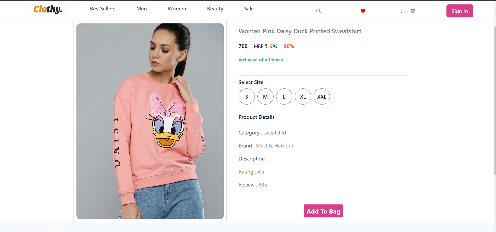

# Clothy.com (changeable-cracker-8993)

### Logo 

Clothy is an online shopping marketplace that offers trendy and affordable clothes and beauty care products for men and women of all ages. It was developed by a team of three members within a five-day timeframe. The website is fully responsive, meaning it is designed to adapt to different screen sizes and devices.

On the user side, the website features a home page that introduces the platform, log-in, and signup functionality using Firebase for authentication, a products page where users can browse and filter products, a single product page for detailed information and adding items to the cart, a cart page that displays selected products and allows quantity adjustments and removal, a payment page offering various payment options, an order success page for successfully placed orders, and a page not found page for handling unavailable routes.

On the admin side, there is a product page for managing products and a dashboard for overall management and control.

The website includes features like sorting and filtering functionalities to help users find products of their choice efficiently. It also incorporates a responsive design to ensure a seamless user experience across different devices.

Overall, Clothy aims to provide a user-friendly and convenient online shopping experience with a wide range of fashionable and affordable products.

### json server is deployed on cyclic, the link is below :
https://vast-red-fawn-cuff.cyclic.app/

### Team Members:
    1. Chandrakala - Team Lead
    2. Shubham Singh - Team Member
    3. Md. Kamran - Team Member

### Tech Stack 
    1. ReactJs
    2. Chakra UI
    3. TypeScript
    4. HTML
    5. CSS
    6. React-Router-Dom
    7. Firebase

## Features
### User Side
    1. Home Page
    2. Login and Signup
    3. Products Page
    4. Single Product Page
    5. Cart Page
    6. Payment Page
    7. Page Not Found Page

### Admin Side
    1. Product Page
    2. Dashboard

## This is how the website looks to the user :

### LandingPage

Clothy is an online shopping marketplace where men and women of every age can find trendy and affordable clothes and beauty care products.

### Products Page

If you have an extensive database, it might be difficult to find the products of your choice, that’s where our sorting and filtering functionalities come in handy to the user. It allows the user to filter the products by various criteria. 

### Single Product Page

To share more details about individual products, here is the single product page. From this page, the user can select the desired size and add the product to cart.

### SignUp Page

Users can create his/her account and the authentication will be done by Firebase.

### Login Page

Users can not access the cart page without login.

### Cart Page

Cart pages show all the products, which have been added to the cart, and let the user increase and decrease the quantity of individual product.
Also, if the user changes his/her mind about any product and doesn't want to buy it, it can be directly removed from the cart by clicking the delete icon.

### Payment Page

Here, on this page, the user will get various options to make the payment. The total amount from the previous page will also be reflected here.
##### After Successfully Payment there is a modal present that shows the payment status.

### Order Success Page

Once the order is successfully placed, it will show the order success page.

## Other Pages And Components

### Page Not Found

If the user tries to navigate to any route which is not available on our website, it will reflect the page not found.

### Empty Cart

If the user deletes all the items from the cart or places the order, in either case, the cart will change into an empty cart page and will show a button "Start Shopping" which will take the user back to the "Products Page"

